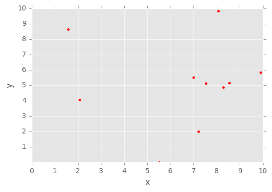
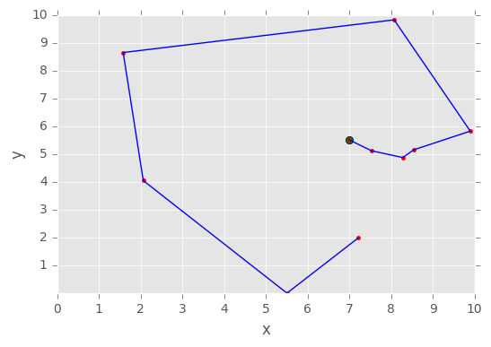

# Ant Colony Optimization for the Traveling Salesman Problem


Importing modules:
- **pants** - ant colony optimization algorithms
- **numpy** - powerful N-dimensional array manipulation
- **matplotlib** - ploing library


```python
from math import sqrt, pow
import random

import pants as ants
import matplotlib.pyplot as plt
import numpy as np
```


```python
euclidean = lambda a, b: sqrt(pow(a[1] - b[1], 2) + pow(a[0] - b[0], 2))
```

Generating random nodes (10x2 array with random numbers from 0 to 10)


```python
nodes = [[random.uniform(0, 10), random.uniform(0, 10)] for _ in range(10)]
nodes
```


    [[8.280000258317028, 4.878922885957136],
     [8.073434485048463, 9.832400964087448],
     [5.505728903749345, 0.000479860696358525],
     [1.5812966562810193, 8.656470584319136],
     [6.98611965741168, 5.52292506838123],
     [2.06320986780102, 4.050254301836748],
     [8.541593497516285, 5.1558132564622685],
     [9.89775152745869, 5.828969978973371],
     [7.210177751319177, 1.9824881570504471],
     [7.5313773283093255, 5.122255731544438]]


Initializing world


```python
world = ants.World(nodes, euclidean)
acoSolver = ants.Solver()
```

Calculating the shortest possible route that visits each nodes exactly once


```python
solution = acoSolver.solve(world)
```

# Plotting nodes chart


```python
plt.style.use('ggplot')

coords = np.array(nodes)
plt.plot(coords[:,0], coords[:,1], 'r.')
plt.xticks(np.arange(0, 11, 1.0))
plt.yticks(np.arange(1, 11, 1.0))
plt.ylabel('y')
plt.xlabel('x')
plt.show()

```





# Plotting the shortest route chart


```python
shortest_route_coords = np.array(solution.tour)
shortest_route_coords
```


    array([[  6.98611966e+00,   5.52292507e+00],
           [  7.53137733e+00,   5.12225573e+00],
           [  8.28000026e+00,   4.87892289e+00],
           [  8.54159350e+00,   5.15581326e+00],
           [  9.89775153e+00,   5.82896998e+00],
           [  8.07343449e+00,   9.83240096e+00],
           [  1.58129666e+00,   8.65647058e+00],
           [  2.06320987e+00,   4.05025430e+00],
           [  5.50572890e+00,   4.79860696e-04],
           [  7.21017775e+00,   1.98248816e+00]])


```python
first_visited_node = coords[solution.start]
plt.plot(first_visited_node[0], first_visited_node[1], 'go')
plt.plot(coords[:,0], coords[:,1], 'r.')
plt.plot(shortest_route_coords[:,0], shortest_route_coords[:,1], 'b')
plt.xticks(np.arange(0, 11, 1.0))
plt.yticks(np.arange(1, 11, 1.0))
plt.ylabel('y')
plt.xlabel('x')
plt.show()

```





```python
first_visited_node
```


    array([ 6.98611966,  5.52292507])


```python
solution.distance
```


    30.464246214920035


```python
solution.tour
```


    [[6.98611965741168, 5.52292506838123],
     [7.5313773283093255, 5.122255731544438],
     [8.280000258317028, 4.878922885957136],
     [8.541593497516285, 5.1558132564622685],
     [9.89775152745869, 5.828969978973371],
     [8.073434485048463, 9.832400964087448],
     [1.5812966562810193, 8.656470584319136],
     [2.06320986780102, 4.050254301836748],
     [5.505728903749345, 0.000479860696358525],
     [7.210177751319177, 1.9824881570504471]]


