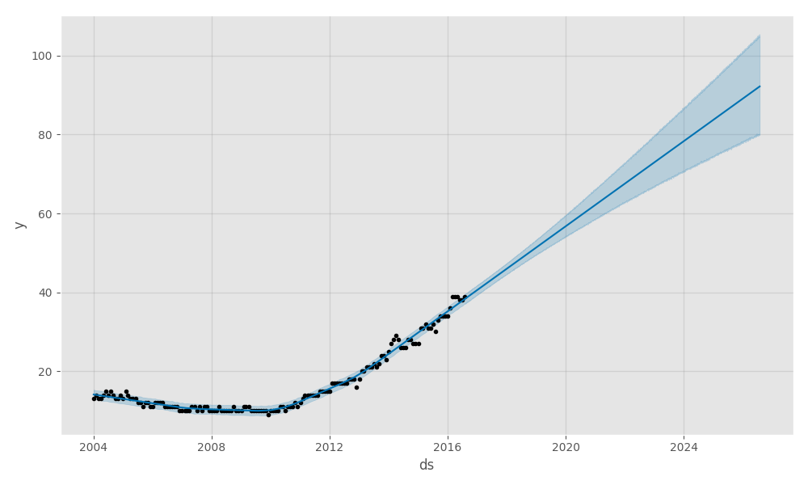

# Predicting trends using [prophet](https://github.com/facebook/prophet)

> e.g Time Series Forecasting with LSTMs and Prophet

**Data (Google trends - NodeJS):**
```csv
ds,y
2004-01,13
2004-02,14
2004-03,13
2004-04,13
...
2007-06,11
2007-07,10
2007-08,11
2007-09,10
2007-10,11
2007-11,11
2007-12,10
2008-01,10
```

**Solution:**
```python
from matplotlib import pyplot as plt
import pandas as pd
from fbprophet import Prophet


def run_prophet(data: pd.DataFrame, periods: int) -> [Prophet, pd.DataFrame]:
    """
    Creates forecasting for time-series data for a specified period of time

    :param data: time-series data frame in with column 'y' for data and 'ds' for timestamps
    :param periods: future prediction timescale in days
    :return: Prophet model and forecasting data frame
    """
    m = Prophet(daily_seasonality=False, yearly_seasonality=False)
    m.fit(data)
    f = m.make_future_dataframe(periods=periods)
    return [m, m.predict(f)]


if __name__ == "__main__":
    # Load csv info data frame
    df = pd.read_csv('./data/nodejs_trends.csv')

    # Forecast data
    model, forecast = run_prophet(df, periods=365 * 10)

    # Plot predicted time-series data
    model.plot(forecast)
    # Save chart into PNG file
    plt.savefig('charts/nodejs_trends.png')
    # Show chart
    plt.show()
```

**Result:**

