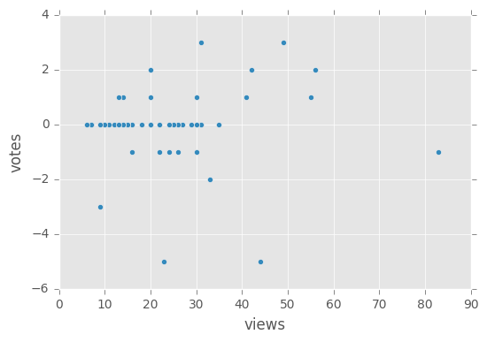
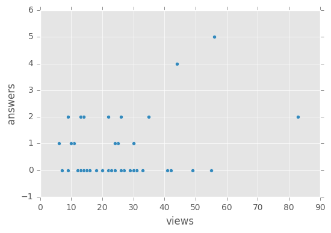
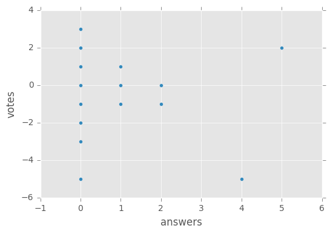

```python
import pandas as pd
import numpy as np
import matplotlib.pyplot as plt

INPUT_JSON_FILE = 'questions.json'
plt.style.use("ggplot")

pd.set_option('display.max_colwidth', -1)
df = pd.read_json(INPUT_JSON_FILE).drop("short_description", 1).drop("tag", 1)
df = df.sort_values(['answers', 'votes', 'views'], ascending=[True, False, False])
df.plot.scatter(x="views", y="votes")
df.plot.scatter(x="views", y="answers")
df.plot.scatter(x="answers", y="votes")
plt.show()
df
```











<div>
<table border="1" class="dataframe">
  <thead>
    <tr style="text-align: right;">
      <th></th>
      <th>answers</th>
      <th>title</th>
      <th>url</th>
      <th>views</th>
      <th>votes</th>
    </tr>
  </thead>
  <tbody>
    <tr>
      <th>23</th>
      <td>0</td>
      <td>Decoding of bytes object results in unexpected + invalid UTF-8 - how can I avoid this?</td>
      <td>https://stackoverflow.com/questions/43256079/decoding-of-bytes-object-results-in-unexpected-invalid-utf-8-how-can-i-avoid</td>
      <td>49</td>
      <td>3</td>
    </tr>
    <tr>
      <th>15</th>
      <td>0</td>
      <td>Pandas analogue of SQL's “NOT IN” operator</td>
      <td>https://stackoverflow.com/questions/43256402/pandas-analogue-of-sqls-not-in-operator</td>
      <td>31</td>
      <td>3</td>
    </tr>
    <tr>
      <th>33</th>
      <td>0</td>
      <td>Split string by number of whitespaces</td>
      <td>https://stackoverflow.com/questions/43255850/split-string-by-number-of-whitespaces</td>
      <td>42</td>
      <td>2</td>
    </tr>
    <tr>
      <th>25</th>
      <td>0</td>
      <td>PyPDF2 - manually adding new page to merged PDF offsets original bookmark destinations</td>
      <td>https://stackoverflow.com/questions/43256025/pypdf2-manually-adding-new-page-to-merged-pdf-offsets-original-bookmark-destin</td>
      <td>20</td>
      <td>2</td>
    </tr>
    <tr>
      <th>31</th>
      <td>0</td>
      <td>Sort a JSON using Python</td>
      <td>https://stackoverflow.com/questions/43255909/sort-a-json-using-python</td>
      <td>55</td>
      <td>1</td>
    </tr>
    <tr>
      <th>42</th>
      <td>0</td>
      <td>Use numpy to translate huge array of 2-byte strings to corresponding 1-byte strings according to a fixed mapping</td>
      <td>https://stackoverflow.com/questions/43255679/use-numpy-to-translate-huge-array-of-2-byte-strings-to-corresponding-1-byte-stri</td>
      <td>41</td>
      <td>1</td>
    </tr>
    <tr>
      <th>19</th>
      <td>0</td>
      <td>Python pandas dataframe convert values without decimals</td>
      <td>https://stackoverflow.com/questions/43256211/python-pandas-dataframe-convert-values-without-decimals</td>
      <td>20</td>
      <td>1</td>
    </tr>
    <tr>
      <th>32</th>
      <td>0</td>
      <td>Python Selenium Get PageSource of XHTML</td>
      <td>https://stackoverflow.com/questions/43255904/python-selenium-get-pagesource-of-xhtml</td>
      <td>14</td>
      <td>1</td>
    </tr>
    <tr>
      <th>22</th>
      <td>0</td>
      <td>Microsoft Exchange Integration in Python</td>
      <td>https://stackoverflow.com/questions/43256137/microsoft-exchange-integration-in-python</td>
      <td>13</td>
      <td>1</td>
    </tr>
    <tr>
      <th>2</th>
      <td>0</td>
      <td>Python store line by line in List from Text File</td>
      <td>https://stackoverflow.com/questions/43256926/python-store-line-by-line-in-list-from-text-file</td>
      <td>31</td>
      <td>0</td>
    </tr>
    <tr>
      <th>49</th>
      <td>0</td>
      <td>Type() not detecting my class (Tree) in Python 3</td>
      <td>https://stackoverflow.com/questions/43255495/type-not-detecting-my-class-tree-in-python-3</td>
      <td>31</td>
      <td>0</td>
    </tr>
    <tr>
      <th>1</th>
      <td>0</td>
      <td>Python: Trying to loggin with requests and perform a HTTP request</td>
      <td>https://stackoverflow.com/questions/43256970/python-trying-to-loggin-with-requests-and-perform-a-http-request</td>
      <td>30</td>
      <td>0</td>
    </tr>
    <tr>
      <th>30</th>
      <td>0</td>
      <td>Google App Engine api throws 503, but error not shown in the admin console</td>
      <td>https://stackoverflow.com/questions/43255910/google-app-engine-api-throws-503-but-error-not-shown-in-the-admin-console</td>
      <td>29</td>
      <td>0</td>
    </tr>
    <tr>
      <th>12</th>
      <td>0</td>
      <td>How to let compiler interpret as bolean context [on hold]</td>
      <td>https://stackoverflow.com/questions/43256479/how-to-let-compiler-interpret-as-bolean-context</td>
      <td>27</td>
      <td>0</td>
    </tr>
    <tr>
      <th>20</th>
      <td>0</td>
      <td>Python Rotation Matirx Error</td>
      <td>https://stackoverflow.com/questions/43256193/python-rotation-matirx-error</td>
      <td>26</td>
      <td>0</td>
    </tr>
    <tr>
      <th>28</th>
      <td>0</td>
      <td>Identifying sublists entirely contained within other lists</td>
      <td>https://stackoverflow.com/questions/43255995/identifying-sublists-entirely-contained-within-other-lists</td>
      <td>22</td>
      <td>0</td>
    </tr>
    <tr>
      <th>8</th>
      <td>0</td>
      <td>SQLITE Python cannot change value</td>
      <td>https://stackoverflow.com/questions/43256747/sqlite-python-cannot-change-value</td>
      <td>20</td>
      <td>0</td>
    </tr>
    <tr>
      <th>47</th>
      <td>0</td>
      <td>Multiple Processing with a loop</td>
      <td>https://stackoverflow.com/questions/43255525/multiple-processing-with-a-loop</td>
      <td>20</td>
      <td>0</td>
    </tr>
    <tr>
      <th>13</th>
      <td>0</td>
      <td>Splitting to make Workbooks</td>
      <td>https://stackoverflow.com/questions/43256475/splitting-to-make-workbooks</td>
      <td>18</td>
      <td>0</td>
    </tr>
    <tr>
      <th>10</th>
      <td>0</td>
      <td>Can I get IP address and port of disconnected client in Tornado</td>
      <td>https://stackoverflow.com/questions/43256641/can-i-get-ip-address-and-port-of-disconnected-client-in-tornado</td>
      <td>16</td>
      <td>0</td>
    </tr>
    <tr>
      <th>11</th>
      <td>0</td>
      <td>repomd.xml missing for epel-release repo</td>
      <td>https://stackoverflow.com/questions/43256563/repomd-xml-missing-for-epel-release-repo</td>
      <td>16</td>
      <td>0</td>
    </tr>
    <tr>
      <th>3</th>
      <td>0</td>
      <td>How to remove specific item and lines from xml?</td>
      <td>https://stackoverflow.com/questions/43256911/how-to-remove-specific-item-and-lines-from-xml</td>
      <td>15</td>
      <td>0</td>
    </tr>
    <tr>
      <th>17</th>
      <td>0</td>
      <td>insert into table from another table with alembic</td>
      <td>https://stackoverflow.com/questions/43256390/insert-into-table-from-another-table-with-alembic</td>
      <td>15</td>
      <td>0</td>
    </tr>
    <tr>
      <th>45</th>
      <td>0</td>
      <td>Certificate verification failed with Python 2.7.13 and OpenSSL 1.1.0e on Ubuntu 16.04</td>
      <td>https://stackoverflow.com/questions/43255589/certificate-verification-failed-with-python-2-7-13-and-openssl-1-1-0e-on-ubuntu</td>
      <td>15</td>
      <td>0</td>
    </tr>
    <tr>
      <th>29</th>
      <td>0</td>
      <td>In python, can I write a function within one file that uses the filename of another file which imports it? [duplicate]</td>
      <td>https://stackoverflow.com/questions/43255967/in-python-can-i-write-a-function-within-one-file-that-uses-the-filename-of-anot</td>
      <td>14</td>
      <td>0</td>
    </tr>
    <tr>
      <th>38</th>
      <td>0</td>
      <td>Installing libLAS on docker python - No such file or directory</td>
      <td>https://stackoverflow.com/questions/43255751/installing-liblas-on-docker-python-no-such-file-or-directory</td>
      <td>12</td>
      <td>0</td>
    </tr>
    <tr>
      <th>18</th>
      <td>0</td>
      <td>Pyqt5 : Error converting .ui file to .py file [on hold]</td>
      <td>https://stackoverflow.com/questions/43256380/pyqt5-error-converting-ui-file-to-py-file</td>
      <td>7</td>
      <td>0</td>
    </tr>
    <tr>
      <th>24</th>
      <td>0</td>
      <td>Keithley 2410 and PyVISA - VI_ERROR_TMO: Timeout expired before operation completed</td>
      <td>https://stackoverflow.com/questions/43256071/keithley-2410-and-pyvisa-vi-error-tmo-timeout-expired-before-operation-comple</td>
      <td>7</td>
      <td>0</td>
    </tr>
    <tr>
      <th>39</th>
      <td>0</td>
      <td>windows 10 virtualenv access denied</td>
      <td>https://stackoverflow.com/questions/43255735/windows-10-virtualenv-access-denied</td>
      <td>7</td>
      <td>0</td>
    </tr>
    <tr>
      <th>0</th>
      <td>0</td>
      <td>Match specific arrayvalue python</td>
      <td>https://stackoverflow.com/questions/43257047/match-specific-arrayvalue-python</td>
      <td>24</td>
      <td>-1</td>
    </tr>
    <tr>
      <th>46</th>
      <td>0</td>
      <td>Multilevel inheritance in python for user inputs</td>
      <td>https://stackoverflow.com/questions/43255536/multilevel-inheritance-in-python-for-user-inputs</td>
      <td>16</td>
      <td>-1</td>
    </tr>
    <tr>
      <th>6</th>
      <td>0</td>
      <td>%d format: a number is required, not NoneType</td>
      <td>https://stackoverflow.com/questions/43256779/d-format-a-number-is-required-not-nonetype</td>
      <td>33</td>
      <td>-2</td>
    </tr>
    <tr>
      <th>14</th>
      <td>0</td>
      <td>JQuery in Python (py File)</td>
      <td>https://stackoverflow.com/questions/43256456/jquery-in-python-py-file</td>
      <td>9</td>
      <td>-3</td>
    </tr>
    <tr>
      <th>26</th>
      <td>0</td>
      <td>python: reverse them for very two elements in list [duplicate]</td>
      <td>https://stackoverflow.com/questions/43256015/python-reverse-them-for-very-two-elements-in-list</td>
      <td>23</td>
      <td>-5</td>
    </tr>
    <tr>
      <th>4</th>
      <td>1</td>
      <td>analysing data using R, AWS lambda and python</td>
      <td>https://stackoverflow.com/questions/43256863/analysing-data-using-r-aws-lambda-and-python</td>
      <td>30</td>
      <td>1</td>
    </tr>
    <tr>
      <th>27</th>
      <td>1</td>
      <td>Construct YAML that contains JSON data in python</td>
      <td>https://stackoverflow.com/questions/43256007/construct-yaml-that-contains-json-data-in-python</td>
      <td>25</td>
      <td>0</td>
    </tr>
    <tr>
      <th>40</th>
      <td>1</td>
      <td>Tkinter - Returning from a class and calling a new one</td>
      <td>https://stackoverflow.com/questions/43255710/tkinter-returning-from-a-class-and-calling-a-new-one</td>
      <td>24</td>
      <td>0</td>
    </tr>
    <tr>
      <th>34</th>
      <td>1</td>
      <td>How to give name to each node in celery</td>
      <td>https://stackoverflow.com/questions/43255831/how-to-give-name-to-each-node-in-celery</td>
      <td>11</td>
      <td>0</td>
    </tr>
    <tr>
      <th>36</th>
      <td>1</td>
      <td>Items movement daily collection database design system issue</td>
      <td>https://stackoverflow.com/questions/43255792/items-movement-daily-collection-database-design-system-issue</td>
      <td>10</td>
      <td>0</td>
    </tr>
    <tr>
      <th>21</th>
      <td>1</td>
      <td>cx_Oracle.DatabaseError: ORA-01858: date time false format</td>
      <td>https://stackoverflow.com/questions/43256153/cx-oracle-databaseerror-ora-01858-date-time-false-format</td>
      <td>6</td>
      <td>0</td>
    </tr>
    <tr>
      <th>7</th>
      <td>1</td>
      <td>Extracting data within multiple links using SCRAPY</td>
      <td>https://stackoverflow.com/questions/43256758/extracting-data-within-multiple-links-using-scrapy</td>
      <td>30</td>
      <td>-1</td>
    </tr>
    <tr>
      <th>16</th>
      <td>2</td>
      <td>Why sorted list_b has no value? [duplicate]</td>
      <td>https://stackoverflow.com/questions/43256396/why-sorted-list-b-has-no-value</td>
      <td>35</td>
      <td>0</td>
    </tr>
    <tr>
      <th>37</th>
      <td>2</td>
      <td>Python - mutable default arguments to functions</td>
      <td>https://stackoverflow.com/questions/43255782/python-mutable-default-arguments-to-functions</td>
      <td>14</td>
      <td>0</td>
    </tr>
    <tr>
      <th>48</th>
      <td>2</td>
      <td>raspberry pi sending data to a XAMPP database</td>
      <td>https://stackoverflow.com/questions/43255524/raspberry-pi-sending-data-to-a-xampp-database</td>
      <td>13</td>
      <td>0</td>
    </tr>
    <tr>
      <th>43</th>
      <td>2</td>
      <td>Python with MySQL connector, no information being sent to database</td>
      <td>https://stackoverflow.com/questions/43255643/python-with-mysql-connector-no-information-being-sent-to-database</td>
      <td>9</td>
      <td>0</td>
    </tr>
    <tr>
      <th>41</th>
      <td>2</td>
      <td>Comparing the order of specific elements in a python list</td>
      <td>https://stackoverflow.com/questions/43255697/comparing-the-order-of-specific-elements-in-a-python-list</td>
      <td>83</td>
      <td>-1</td>
    </tr>
    <tr>
      <th>35</th>
      <td>2</td>
      <td>How can I add the first line in a text file to following lines until a condition is met then repeat?</td>
      <td>https://stackoverflow.com/questions/43255808/how-can-i-add-the-first-line-in-a-text-file-to-following-lines-until-a-condition</td>
      <td>26</td>
      <td>-1</td>
    </tr>
    <tr>
      <th>5</th>
      <td>2</td>
      <td>Getting an array from collections ordereddict for the maximum key, values</td>
      <td>https://stackoverflow.com/questions/43256822/getting-an-array-from-collections-ordereddict-for-the-maximum-key-values</td>
      <td>22</td>
      <td>-1</td>
    </tr>
    <tr>
      <th>44</th>
      <td>4</td>
      <td>Why does np.array([4, 3, 0]) + np.array([0, 2, 2]) give an output of array([4,5,2])</td>
      <td>https://stackoverflow.com/questions/43255628/why-does-np-array4-3-0-np-array0-2-2-give-an-output-of-array4-5</td>
      <td>44</td>
      <td>-5</td>
    </tr>
    <tr>
      <th>9</th>
      <td>5</td>
      <td>Compare two lists of tuples</td>
      <td>https://stackoverflow.com/questions/43256677/compare-two-lists-of-tuples</td>
      <td>56</td>
      <td>2</td>
    </tr>
  </tbody>
</table>
</div>


```python

```
